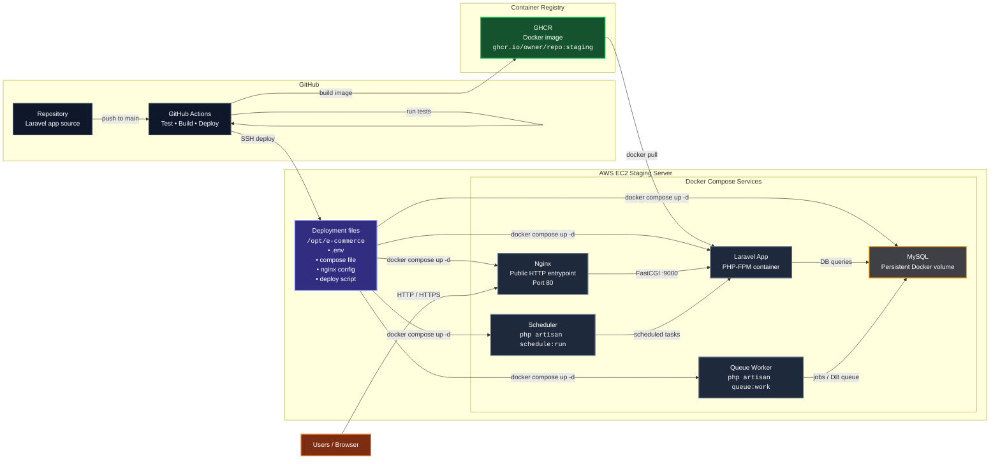

## Staging Docker Commands

SSH into your EC2 instance and go to the app directory:
```bash
cd /opt/e-commerce
```

### 1. See running containers
```bash
docker ps
```

See all containers, including stopped ones:
```bash
docker ps -a
```

### 2. See Docker images
```bash
docker images
```

### 3. See Docker Compose service status
```bash
docker-compose -f docker-compose.staging.yaml ps
```

### 4. Start containers
```bash
docker-compose -f docker-compose.staging.yaml up -d
```

### 5. Stop containers
```bash
docker-compose -f docker-compose.staging.yaml stop
```

### 6. Restart containers

Restart all services:
```bash
docker-compose -f docker-compose.staging.yaml restart
```

Restart one service:
```bash
docker-compose -f docker-compose.staging.yaml restart app
```

### 7. Recreate containers
```bash
docker-compose -f docker-compose.staging.yaml up -d --force-recreate
```

### 8. Pull latest images
```bash
docker-compose -f docker-compose.staging.yaml pull
```

### 9. View logs

All services:
```bash
docker-compose -f docker-compose.staging.yaml logs
```

Live logs:
```bash
docker-compose -f docker-compose.staging.yaml logs -f
```

### 10. View logs for one service

App:
```bash
docker-compose -f docker-compose.staging.yaml logs -f app
```

Nginx:
```bash
docker-compose -f docker-compose.staging.yaml logs -f nginx
```

Queue:
```bash
docker-compose -f docker-compose.staging.yaml logs -f queue
```

Scheduler:
```bash
docker-compose -f docker-compose.staging.yaml logs -f scheduler
```

MySQL:
```bash
docker-compose -f docker-compose.staging.yaml logs -f mysql
```

### 11. Open a shell inside a container

App container:
```bash
docker-compose -f docker-compose.staging.yaml exec app sh
```

If `bash` exists:
```bash
docker-compose -f docker-compose.staging.yaml exec app bash
```

MySQL container:
```bash
docker-compose -f docker-compose.staging.yaml exec mysql sh
```

### 12. Run Laravel commands inside the app container

Laravel version:
```bash
docker-compose -f docker-compose.staging.yaml exec app php artisan --version
```

Run migrations:
```bash
docker-compose -f docker-compose.staging.yaml exec app php artisan migrate --force
```

Clear config:
```bash
docker-compose -f docker-compose.staging.yaml exec app php artisan config:clear
```

Cache config:
```bash
docker-compose -f docker-compose.staging.yaml exec app php artisan config:cache
```

Show routes:
```bash
docker-compose -f docker-compose.staging.yaml exec app php artisan route:list
```

Laravel environment info:
```bash
docker-compose -f docker-compose.staging.yaml exec app php artisan about
```

### 13. See environment variables inside the app container
```bash
docker-compose -f docker-compose.staging.yaml exec app printenv
```

Filter DB values:
```bash
docker-compose -f docker-compose.staging.yaml exec app printenv | grep DB_
```

### 14. Check database connectivity from Laravel
```bash
docker-compose -f docker-compose.staging.yaml exec app php artisan migrate:status
```

### 15. Connect to MySQL inside the container
```bash
docker-compose -f docker-compose.staging.yaml exec mysql mysql -u root -p
```

### 16. Inspect a container
```bash
docker inspect ecommerce-app
```

### 17. See resource usage
```bash
docker stats
```

### 18. Remove stopped containers
```bash
docker container prune
```

### 19. Remove unused images
```bash
docker image prune -a
```

### 20. Bring everything down
```bash
docker-compose -f docker-compose.staging.yaml down
```

Bring everything down and remove volumes:
```bash
docker-compose -f docker-compose.staging.yaml down -v
```

### 21. Manual deployment flow for debugging
```bash
cd /opt/e-commerce
docker login ghcr.io -u YOUR_GITHUB_USERNAME
docker-compose -f docker-compose.staging.yaml pull
docker-compose -f docker-compose.staging.yaml up -d --remove-orphans
docker-compose -f docker-compose.staging.yaml ps
docker-compose -f docker-compose.staging.yaml logs -f app
```

### 22. Verify important files on EC2
```bash
ls -la /opt/e-commerce
ls -la /opt/e-commerce/docker/nginx
ls -la /opt/e-commerce/scripts
```

Check important env values:
```bash
grep '^APP_IMAGE=' /opt/e-commerce/.env
grep '^DB_' /opt/e-commerce/.env
```

### 23. Quick health checks

Are containers up?
```bash
docker-compose -f docker-compose.staging.yaml ps
```

Can Laravel boot?
```bash
docker-compose -f docker-compose.staging.yaml exec app php artisan about
```

Can Laravel list routes?
```bash
docker-compose -f docker-compose.staging.yaml exec app php artisan route:list
```

Is MySQL healthy?
```bash
docker-compose -f docker-compose.staging.yaml logs mysql
```

Is Nginx serving traffic?
```bash
curl -I http://localhost
```

### 24. Optional shell alias
```bash
alias dcs='docker-compose -f /opt/e-commerce/docker-compose.staging.yaml'
```

Then you can run:
```bash
dcs ps
dcs logs -f app
dcs exec app php artisan about
dcs restart
```


