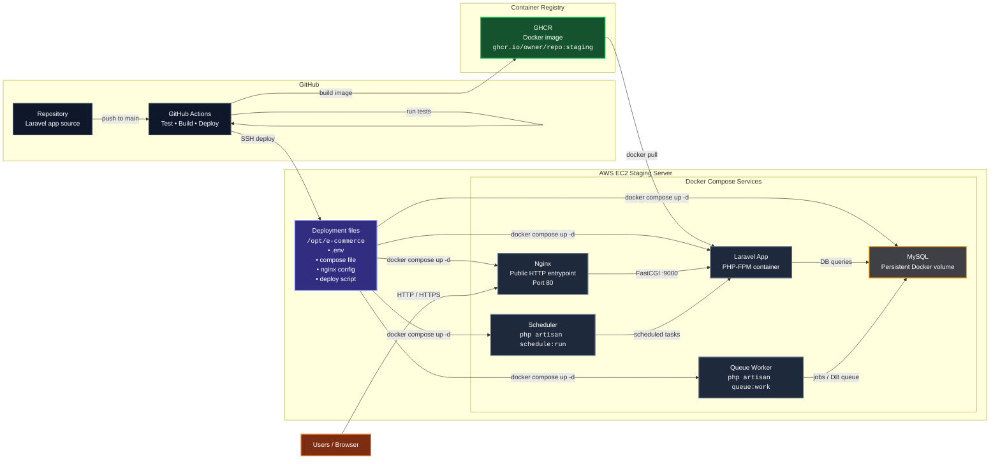

```mermaid
flowchart LR
    %% =========================
    %% Nodes
    %% =========================

    subgraph DEV["GitHub"]
        REPO["Repository<br/>Laravel app source"]
        ACTIONS["GitHub Actions<br/>Test • Build • Deploy"]
        REPO -->|"push to main"| ACTIONS
    end

    subgraph REG["Container Registry"]
        GHCR["GHCR<br/>Docker image<br/><code>ghcr.io/owner/repo:staging</code>"]
    end

    subgraph SERVER["AWS EC2 Staging Server"]
        DEPLOY["Deployment files<br/><code>/opt/e-commerce</code><br/>• .env<br/>• compose file<br/>• nginx config<br/>• deploy script"]

        subgraph DOCKER["Docker Compose Services"]
            NGINX["Nginx<br/>Public HTTP entrypoint<br/>Port 80"]
            APP["Laravel App<br/>PHP-FPM container"]
            QUEUE["Queue Worker<br/><code>php artisan queue:work</code>"]
            SCHED["Scheduler<br/><code>php artisan schedule:run</code>"]
            MYSQL["MySQL<br/>Persistent Docker volume"]
        end
    end

    USERS["Users / Browser"]

    %% =========================
    %% CI/CD flow
    %% =========================

    ACTIONS -->|"run tests"| ACTIONS
    ACTIONS -->|"build image"| GHCR
    ACTIONS -->|"SSH deploy"| DEPLOY
    GHCR -->|"docker pull"| APP
    DEPLOY -->|"docker compose up -d"| NGINX
    DEPLOY -->|"docker compose up -d"| APP
    DEPLOY -->|"docker compose up -d"| QUEUE
    DEPLOY -->|"docker compose up -d"| SCHED
    DEPLOY -->|"docker compose up -d"| MYSQL

    %% =========================
    %% Runtime flow
    %% =========================

    USERS -->|"HTTP / HTTPS"| NGINX
    NGINX -->|"FastCGI :9000"| APP
    APP -->|"DB queries"| MYSQL
    QUEUE -->|"jobs / DB queue"| MYSQL
    SCHED -->|"scheduled tasks"| APP

    %% =========================
    %% Styling
    %% =========================

    classDef github fill:#0f172a,stroke:#334155,color:#ffffff,stroke-width:2px;
    classDef registry fill:#14532d,stroke:#22c55e,color:#ffffff,stroke-width:2px;
    classDef server fill:#1e293b,stroke:#64748b,color:#ffffff,stroke-width:2px;
    classDef deploy fill:#312e81,stroke:#818cf8,color:#ffffff,stroke-width:2px;
    classDef edge fill:#111827,stroke:#60a5fa,color:#ffffff,stroke-width:2px;
    classDef db fill:#3f3f46,stroke:#f59e0b,color:#ffffff,stroke-width:2px;
    classDef user fill:#7c2d12,stroke:#fb923c,color:#ffffff,stroke-width:2px;

    class REPO,ACTIONS github;
    class GHCR registry;
    class DEPLOY deploy;
    class NGINX,APP,QUEUE,SCHED server;
    class MYSQL db;
    class USERS user;
```
```
